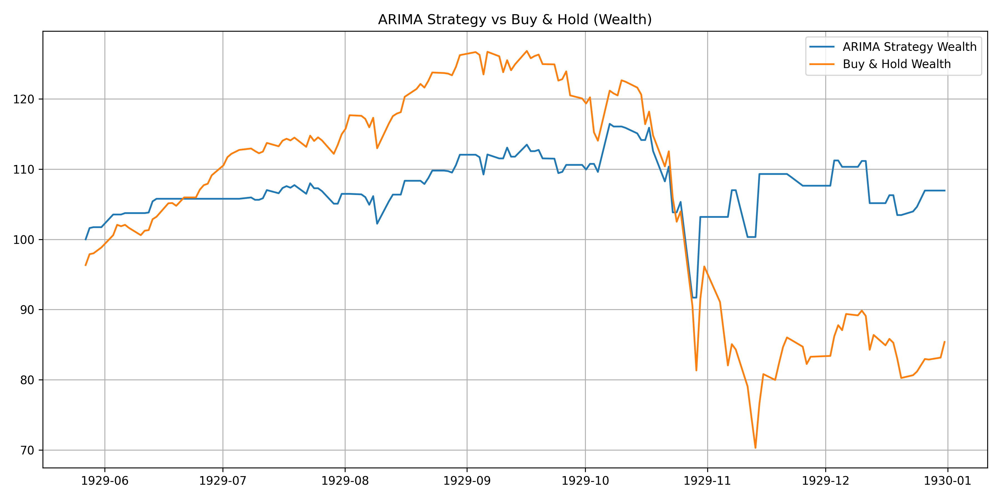

# 📈 ARIMA-Based Trading Strategy on S&P 500

This repository contains an implementation of an **ARIMA-based trading strategy** applied to the **S&P 500 index**.  
The project compares the performance of an ARIMA-driven trading strategy against a simple **Buy & Hold** benchmark.  

---

## 🚀 Features
- Loads and preprocesses historical S&P 500 data.
- Computes daily returns and log-returns.
- Dynamically determines ARIMA `(p,0,q)` parameters using **ACF** and **PACF**.
- Generates **1-step ahead forecasts** of returns.
- Builds a trading strategy using forecast signals.
- Evaluates performance vs **Buy & Hold** strategy.
- Saves wealth comparison plots.

---

## 📂 Repository Structure
```
.
├── CODE/
│   ├── ARIMA_trading.py         # Main script
│   ├── ARIMA_on_daily_ret.py    
│   ├── ARIMA.py
│   └── get_data.py              # Script for data collecting
├── DATA/
│   └── S&P500_2025.csv          # Where datasets are stored
├── PLOTS/
│   └── ARIMA_trading/           # Output plots
│   README.md                    # Documentation
└── requirements.txt
```

---

## ⚙️ Requirements
To run the program, first install the required dependencies using:

```bash
pip install -r requirements.txt
```


---

## ▶️ Usage
1. Get the data running the script:
```bash
python get_data.py
```

2. Run the script:

```bash
python ARIMA_trading.py
```

3. The script will:
   - Print the final wealth of ARIMA strategy vs Buy & Hold.
   - Save plots under `PLOTS/ARIMA_trading/`.

---

## 📊 Example Output
Example plot comparing ARIMA Strategy vs Buy & Hold:



---

## 📝 Parameters
- **window_size**: Rolling window length used for ARIMA training (default: `100`).
- **start_year** / **end_year**: Time period for backtesting (default: 2022–2024).

---

